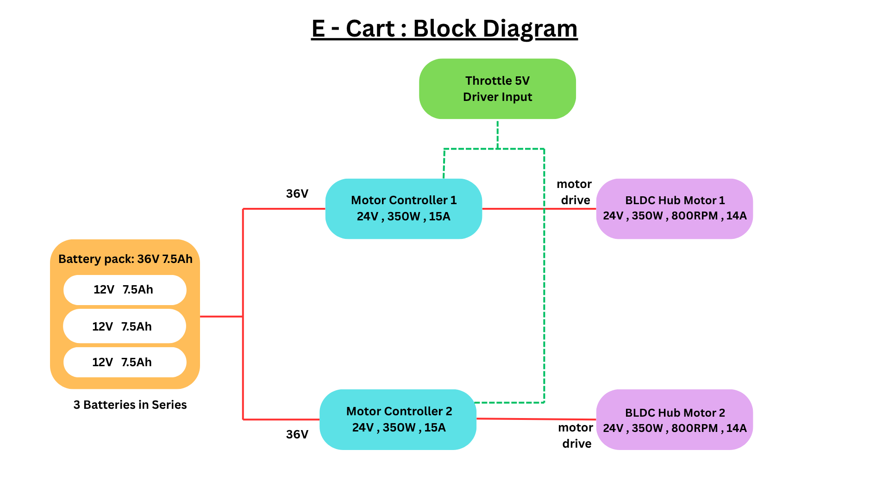
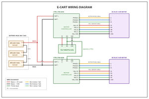
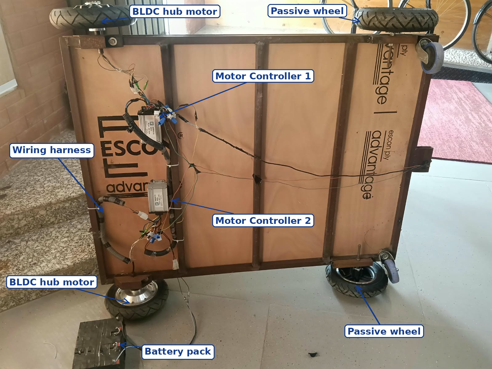

# E-Cart: Electric Luggage Carrying Cart

   

---

## About

A battery-powered cart for carrying luggage and materials from one place to another. It runs on two BLDC hub motors powered by a 36V lead-acid battery pack and is controlled with a single throttle.

Built at Chitkara University with guidance from university staff, over about three months.

---

## At a Glance

| | |
|---|---|
| **Purpose** | Carry luggage and materials between two places |
| **Drive** | 2 x 10-inch BLDC hub motors (350W kit) |
| **Power** | 36V, 7.5Ah lead-acid pack (3 x 12V in series) |
| **Control** | One throttle for both motors |
| **Wheels** | 2 driven (hub motor) and 2 passive |
| **Load** | Carried three people standing on the deck (roughly 250 kg combined) in an informal trial; no formal load test done |
| **Build time** | About 3 months |

---

## Components

| Component | Specification | Qty | Role |
|---|---|---|---|
| BLDC hub motor kit | 10-inch hub motor with controller and throttle (350W kit, Robokits RKI-9113) | 2 | Drives the wheels directly |
| Throttle | 5V throttle supplied with the motor kit | 1 | Driver speed input for both motors |
| Lead-acid battery | 12V 7.5Ah, connected in series for 36V | 3 | Power source |
| Dummy wheel | 10-inch, passive | 2 | Carries load |

Full parts list with prices: [docs/components-and-cost.md](docs/components-and-cost.md)

---

## System Design

**Power:** Three 12V batteries in series make a 36V pack. Both motor controllers are connected in parallel to this one pack, and each controller drives one hub motor.

**Control:** The throttle is connected directly to Controller 1. Only the signal wire of Controller 2 is joined to the signal wire of Controller 1, so both controllers receive the same speed command from a single throttle.

**Drive:** Each hub motor sits inside its wheel and drives it directly, with no chain, belt, or gearbox. The controller switches current through the motor's three phases to keep the wheel turning.

*Wiring diagram: battery pack, both controllers, throttle, and hub motors*

*Controllers, wiring harness, hub motors, and battery on the cart*

---

## Challenges and Learnings

**Mechanical mounting was the hardest part.** Fitting the wheels and hub motors to the metal frame so that everything lined up took the most effort. With help from university staff, we made the mounting parts using 45-degree cuts so the motors and wheels fit the frame properly.

*Hub motor wheels with the mounting brackets made for the frame*

**A short-circuit mistake.** During the build, I accidentally touched both wires of the 36V battery pack together. The short circuit caused sparks and a burning smell. It showed me first-hand why battery terminals need to be insulated, why wires should be handled carefully, and why protection matters before a pack is connected.

**Learning by doing.** There is a big difference between talking about a project and actually building it. Three months of hands-on work taught me more than reading about it ever could, from mechanical fitting to electrical safety.

---

## Safety and Disclaimer

This repository is for documentation only. **Do not try to build this on your own.** Lead-acid batteries and motor controllers can deliver very high current, and a wrong connection can short-circuit the batteries and cause sparks, overheating, fire, or injury. Build something like this only with an expert or proper guidance, with correct fuses, insulated wiring, and safety checks.

---

## Author

**Jagrit Bansal**
[GitHub](https://github.com/Jagrit-2007) | [LinkedIn](https://linkedin.com/in/jagritbansal-737993381)
